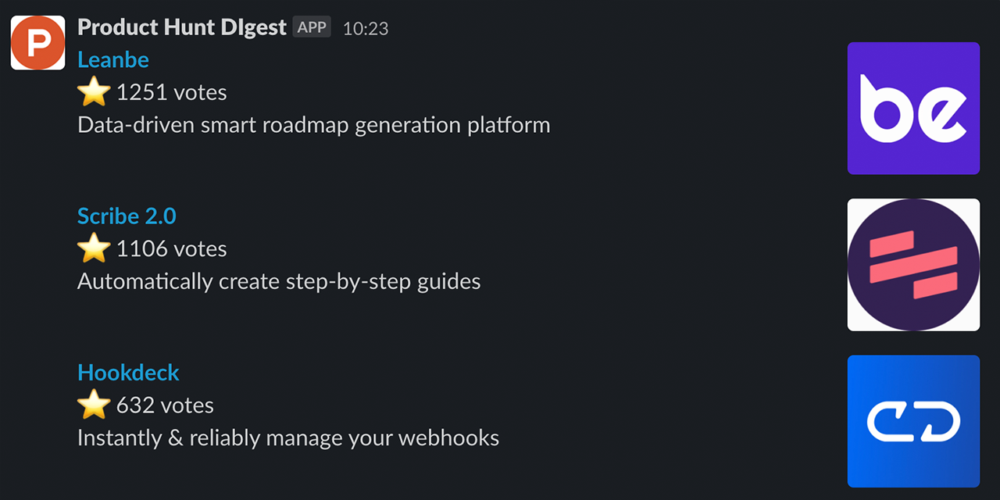

# Product Hunt Digest

<a href="https://www.producthunt.com/posts/product-hunt-digest?utm_source=badge-featured&utm_medium=badge&utm_souce=badge-product-hunt-digest" target="_blank"></a>
<a href="https://www.producthunt.com/posts/product-hunt-digest?utm_source=badge-top-post-badge&utm_medium=badge&utm_souce=badge-product-hunt-digest" target="_blank"></a>

This open-source project generates a daily digest of top performing products on Product Hunt directly to your Slack.

Setup is very simple, and takes a few minutes.



## Installation

Make sure you have installed on your environment Git, Node, and npm.

This code is running on AWS Lambda function, so you'll need an AWS account as well.

Ultimately this code sends the digest to Slack, so make sure you got an [incoming webhook URL](https://api.slack.com/messaging/webhooks) set.

```bash
git clone git@github.com:ranrib/producthunt-digest.git
cd producthunt-digest
npm install
cp config_example.yml config.yml
```

Now edit `config.yml` file and set the Slack webhook URL, and the number of posts you would like to get on the daily digest.

## Running Locally

```bash
npm run start
```

The script will send the current digest into your Slack.

## Deployment

```bash
npm run deploy
```

To test that the Lambda function is running properly:
```bash
npm run invoke
```

## License

Provided under the MIT license. See LICENSE for details.

Copyright 2021, Ran Ribenzaft.
